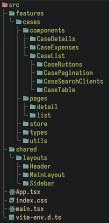
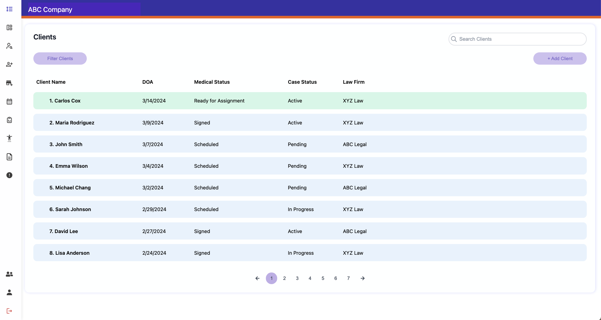

# Case Management Dashboard - Coding Challenge

## Description

This is a case management dashboard application built using React.js, Vite, and Typescript.
The project structure follows the feature-based organization pattern. That allows us to keep the code organized and maintainable in the long run.

The application includes:

- Pagination.
- Search by client name. Implemented with a debounce functionality for better performance.
- Filter by status.
- Modal for expenses (add and delete works).
- State management with Zustand.
- Routing with React Router.
- UI consistency. Even if we don't have a Figma design, we follow the images guidelines.

## Project Structure

## Screenshots

