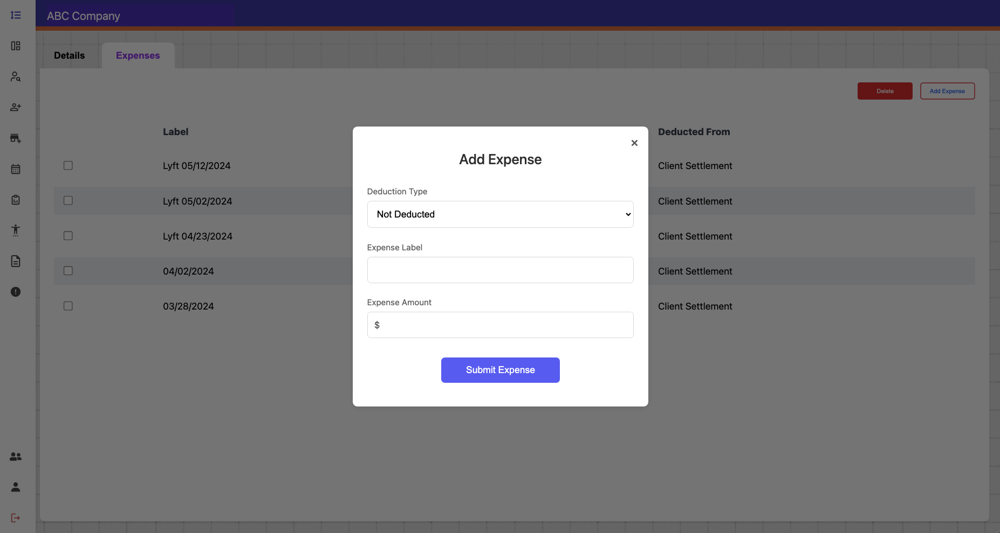
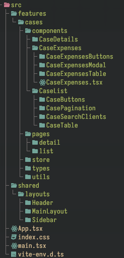

# Case Management Dashboard - Coding Challenge

## Description

This is a case management dashboard application built using React.js, Vite, and Typescript.
The project structure follows the feature-based organization pattern. That allows us to keep the code organized and maintainable in the long run.

The application includes:

- Pagination.
- Search by client name. Implemented with a debounce functionality for better performance.
- Filter by status.
- Modal for expenses (add and delete works).
- State management with `Zustand`. First time using this state management library.
- Routing with `React Router`.
- UI consistency. Even if we don't have a Figma design, we follow the images guidelines.
- Absolute imports with vite-tsconfig-paths.

## Installation

1. Clone the repository.
2. Install dependencies using `npm install`.
3. Run the application using `npm run dev`.
4. Open your browser and navigate to the specified localhost URL.
5. Enjoy 😈

## Deployed app web site

<https://68064a8990e7b510826ff87e--casemanagementchallengesergio.netlify.app/>

## Screenshots

## Project Structure

